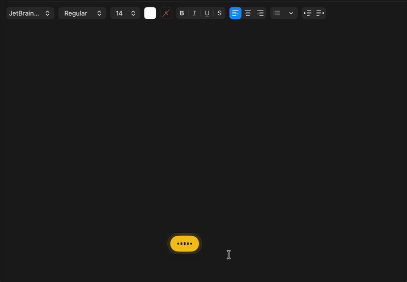
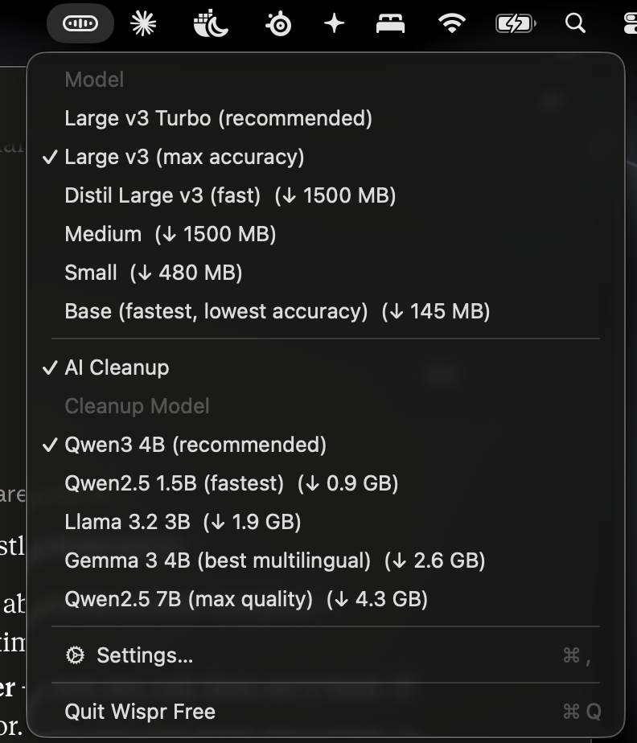
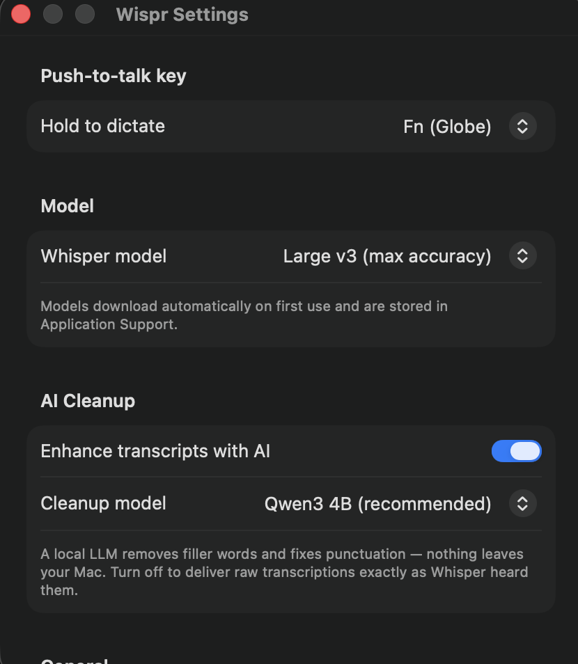

# Wispr Free

Free push-to-talk dictation for macOS. Hold **Fn**, speak, release — your
words appear in whatever app has focus. No cloud, no account, no
subscription: Wispr Free never sends your audio or text anywhere. See
[PRIVACY.md](PRIVACY.md) for the full picture, including the one optional
network call it makes (a daily update check).



## Download

**⬇️ [Download the latest Wispr Free](https://github.com/jordanmoyo/wispr-free/releases/latest)**
— grab `WisprFree-<version>-arm64.zip` under "Assets".

The app comes ready to use: signed and notarized by Apple, for Apple Silicon
Macs (M1 or later) on macOS 14+. No build tools needed — unzip, move
**Wispr Free.app** to `/Applications`, open, and dictate. Full steps in
[Install](#install) below.

## Features

- **On-device transcription** with [WhisperKit](https://github.com/argmaxinc/WhisperKit)
  running Whisper `large-v3`. The spoken language is auto-detected and
  transcribed as-is — never translated.
- **Optional AI cleanup** of transcripts with an on-device LLM
  ([MLX](https://github.com/ml-explore/mlx-swift)): removes filler words,
  fixes punctuation, formats spoken URLs and emails. Five selectable models
  from the menu (Qwen3 4B default, 0.9–4.3 GB each, downloaded on first use).
- **Language-preserving cleanup**: the cleanup never translates. English stays
  English, French stays French, and mixed-language dictation keeps its
  code-switching exactly where you spoke it.
- **Types anywhere**: text is delivered through the Accessibility API with a
  Unicode-keystroke fallback — native apps, Electron apps, web views,
  terminals. Even apps that hide their text fields from Accessibility get
  the text typed in automatically, and it never synthesizes Cmd+V. A copy
  always lands on the clipboard as a safety net.
- **Menu-bar app** with a recording pill overlay while you speak.
- **Dictation history** with search and analytics (total dictations, total
  words, words this week, words per minute) in a dedicated History window —
  stored locally, easy to clear.
- **Per-app delivery rules**: choose per app whether text is typed
  automatically, copied only, or typed and sent with Return (e.g. for chat
  apps).
- **Correction learning**: edits you make to a delivered transcript are
  remembered and applied automatically next time the same word comes up.
- **Pinned transcription language**, for when auto-detection guesses wrong
  on a short or ambiguous clip.
- **Pre-roll audio buffer** (opt-in): keeps a rolling few seconds of audio
  before you hold Fn, so dictation doesn't clip the first word if you start
  speaking right as you press the key.
- **Automatic update check**: once a day, a lightweight check against GitHub
  releases lets you know when a new version is out. Optional — see
  [PRIVACY.md](PRIVACY.md).

<p align="center">
  
  &nbsp;&nbsp;
  
</p>

## Requirements

- Apple Silicon Mac (M1 or later). Intel is not supported — the cleanup LLM
  runs on [MLX](https://github.com/ml-explore/mlx-swift), which requires
  Apple Silicon.
- macOS 14 (Sonoma) or later.
- Disk space for models: ~3 GB for Whisper, plus 0.9–4.3 GB per optional
  cleanup model. Models download automatically on first use.

## Install

1. Download `WisprFree-<version>-arm64.zip` from the
   [latest release](https://github.com/jordanmoyo/wispr-free/releases/latest)
   ("Assets" section), unzip, and move **Wispr Free.app** to `/Applications`.

   Alternatively, with [Homebrew](https://brew.sh):
   ```sh
   brew install --cask jordanmoyo/tap/wispr-free
   ```
   (tap goes live with the 0.2.0 release). Brew users update with
   `brew upgrade`.
2. Open it. The app is notarized by Apple, so it opens normally.
3. Grant the three permissions it asks for (all required for dictation):
   **Microphone** (recording), **Input Monitoring** (detecting the held Fn
   key), **Accessibility** (typing text into the focused app).
4. Hold **Fn**, speak, release. The first dictation downloads the Whisper
   model (~3 GB), so give it a few minutes.

## Build from source

```sh
git clone https://github.com/jordanmoyo/wispr-free.git
cd wispr-free
xcodebuild -downloadComponent MetalToolchain   # one-time per machine
./scripts/package_app.sh
open dist
```

> **Why not just `swift build`?** The MLX cleanup layer compiles Metal GPU
> shaders, which only works under `xcodebuild` — a plain SwiftPM build
> produces a binary that aborts on first cleanup. The packaging script also
> places `mlx-swift_Cmlx.bundle` in `Contents/Resources`, the only location
> MLX's metallib loader searches inside an app bundle. Details in
> [CONTRIBUTING.md](CONTRIBUTING.md).

Unit tests need none of that: `swift test` works anywhere.

## Changelog

### 0.4.0
- **Added:** language selection in the menu-bar menu — English, French, or
  Free transcription (auto-detect).
- **Changed:** the menu-bar menu is more compact — model and cleanup-model
  lists are now submenus showing the current choice at a glance.
- **Added:** the recording pill shows small initials under the waveform
  (EN / FR / FT) so you always know the dictation language.
- **Changed:** the transcribing indicator is now on-brand — the waveform
  bars ripple in gold on a navy capsule instead of a generic spinner.

### 0.3.3
- **Fixed:** clicking the app icon in the Dock, Finder, or Launchpad while
  the app is running now opens the main window instead of doing nothing.

### 0.3.2
- **Added:** a small note on the About pane inviting you to star the repo
  on GitHub if you enjoy the app.

### 0.3.1
- **Fixed:** the app now shows a Dock icon (and appears in Cmd-Tab) while
  the main window is open, returning to menu-bar-only when it closes.

### 0.3.0
- **Fixed:** the Settings window could open invisible (collapsed to a bare
  titlebar) on recent macOS builds, which also hid the language selection.
  Settings, History, Learning, and About now live in one redesigned main
  window that always opens at full size.
- **Added:** unified main window with sidebar navigation — History,
  Learning, General, Push to Talk, Microphone, Language & Model, Privacy,
  and About in one place.
- **Added:** activation mode — hold to talk (default) or press once to
  start and again to stop.
- **Added:** recording pill position — bottom center, top center, or near
  the text cursor.
- **Added:** input microphone selection with a live level meter.
- **Added:** optional feedback sounds when recording starts and stops.

### 0.2.1
- **Fixed:** the AI cleanup model could translate non-English dictation to
  English despite being told not to (e.g. an all-French transcript delivered
  in English). A deterministic on-device language check now compares the
  cleanup output's language against the transcript's and delivers the raw
  transcript whenever they differ — translation can never reach your cursor.

### 0.2.0
- **Added:** dictation history and analytics window — search past
  transcripts, see total dictations, total words, words this week, and
  words per minute.
- **Added:** correction learning — edits to a delivered transcript are
  remembered and applied automatically next time.
- **Added:** per-app delivery rules, including insert-and-send (type, then
  press Return) for apps like chat clients.
- **Added:** pinned transcription language, for when auto-detection guesses
  wrong.
- **Added:** opt-in pre-roll audio buffer, so dictation doesn't clip the
  first word.
- **Added:** automatic update checker (daily, optional, off in
  Settings → General).
- **Changed:** Settings window reorganized into tabs.
- **Added:** [PRIVACY.md](PRIVACY.md) — a full accounting of what's stored
  locally and the one optional network call.

### 0.1.4
- **Fixed:** the AI cleanup model could answer question-shaped dictation
  instead of cleaning it (e.g. dictating "can you tell me…" produced an
  invented reply). Transcripts are now passed as clearly-marked data, and a
  plausibility guard delivers the raw transcript whenever the model's output
  doesn't look like a cleanup — hallucinated text can never reach your cursor.

### 0.1.3
- **Fixed:** dictated text required a manual ⌘V in apps that don't expose
  their focused text field through the Accessibility API (many Electron
  apps, web views, custom widgets). Text is now typed automatically into
  whatever has keyboard focus, with the clipboard copy kept as a backup.

### 0.1.2
- **Fixed:** non-English dictation was translated into English. The spoken
  language is now auto-detected and transcribed verbatim — French stays
  French, and mixed-language dictation keeps its code-switching.

### 0.1.1
- **Fixed:** every dictation produced only "you". The v0.1.0 release build
  was signed without the microphone entitlement, so macOS silently denied
  audio recording (no permission prompt, no entry in System Settings) and
  Whisper transcribed silence. Do not use v0.1.0.

### 0.1.0
- Initial release: push-to-talk dictation (hold Fn), Whisper `large-v3`
  transcription, optional on-device AI cleanup, notarized Apple Silicon app.

## License

[MIT](LICENSE)
